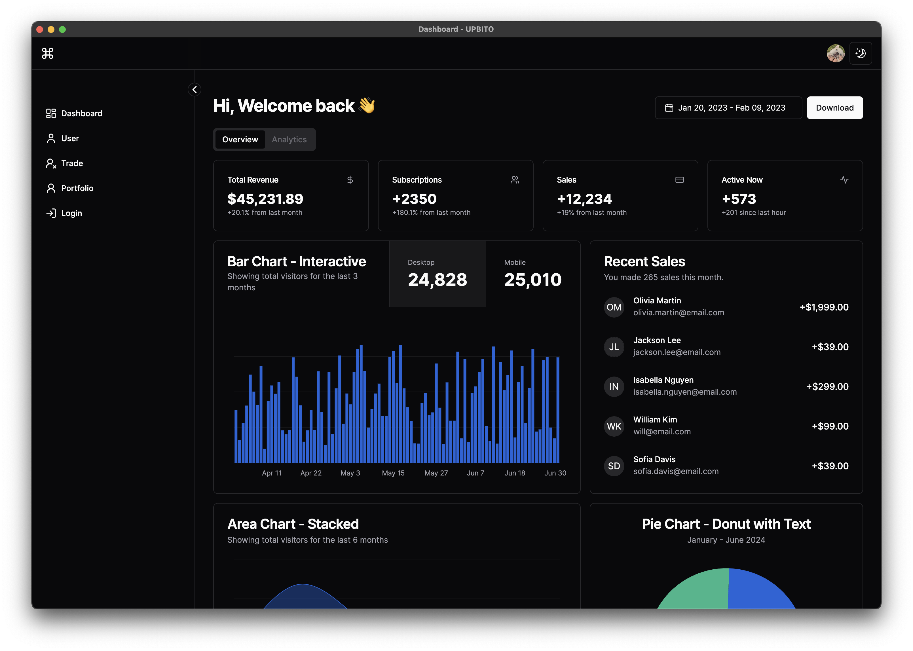

# UPBITO

  

UPBITO는 가상화폐 거래소인 업비트의 거래를 도와주는 DESKTOP 애플리케이션입니다.

## 🛠 기술 스택

## 🚧 목표 기능

- **실시간 거래**: 실시간으로 가상화폐 거래를 할 수 있습니다.
- **TradingView 차트**: 업계 최고의 차트를 지원합니다.
- **자동화 거래**: 자신만의 알고리즘을 적용해 자동화된 거래가 가능합니다.
- **사용자 친화적 인터페이스**: 직관적이고 사용하기 쉬운 인터페이스를 제공합니다.

## 설치 및 실행
###작성중...
